<picture>
  <source media="(prefers-color-scheme: dark)" srcset="https://raw.githubusercontent.com/rohitkumar8279/rohitkumar8279/output/github-contribution-grid-snake-dark.svg">
  <source media="(prefers-color-scheme: light)" srcset="https://raw.githubusercontent.com/rohitkumar8279/rohitkumar8279/output/github-contribution-grid-snake.svg">
  
</picture>

&nbsp;&nbsp;

